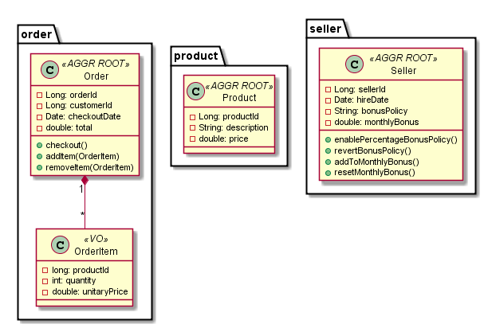

# Zenika NightClazz DDD sample

This repository contains a small sample of DDD implementation with SeedStack business framework for the Zenika DDD NightClazz
of 2016-05-19. You can follow the sample by cloning this repository and

* The `master` branch contains the fully completed sample.
* Each `step-?` branch contains the final state of each step described below.

# Step-by-step

## Initial step

Checkout the `step-0` branch:

    git checkout step-0

The resulting state is a skeleton project containing basic application configuration and various `README.md` files explaining
the structure. Even if no code has been written yet, the project can be run by launching the `main()` method of the
`org.seedstack.seed.core.SeedMain` class. This will launch the Undertow embedded server to expose the application
on the [http://localhost:8080](http://localhost:8080) URL.

## Step 1: the domain model

The domain model goes in the `com.github.adrienlauer.nightclazz.domain.model` package with a subpackage for each aggregate.

### The order aggregate

The order aggregate represents a commercial order of products, in the subpackage `order`. It is composed of the `OrderItem`
value object:

    public class OrderItem extends BaseValueObject {
        private long productId;
        private int quantity;
        private double unitaryPrice;

        public OrderItem(long productId, int quantity, double unitaryPrice) {
            this.productId = productId;
            this.quantity = quantity;
            this.unitaryPrice = unitaryPrice;
        }

        public int getQuantity() {
            return quantity;
        }

        public long getProductId() {
            return productId;
        }

        public double getUnitaryPrice() {
            return unitaryPrice;
        }
    }

And the `Order` entity which acts as the aggregate root, ensuring integrity of the whole aggregate:

    public class Order extends BaseAggregateRoot<Long> {
        private Long orderId;
        private Long customerId;
        private Date checkoutDate;
        private Map<Long, OrderItem> items = new HashMap<>();
        private double total = 0d;

        public Order(Long orderId, Long customerId) {
            this.orderId = orderId;
            this.customerId = customerId;
        }

        @Override
        public Long getEntityId() {
            return orderId;
        }

        public Long getOrderId() {
            return orderId;
        }

        public Long getCustomerId() {
            return customerId;
        }

        public Date getCheckoutDate() {
            return checkoutDate;
        }

        public void checkout() {
            checkoutDate = new Date();
        }

        public boolean isCompleted() {
            return checkoutDate != null;
        }

        public void addItem(OrderItem orderItem) {
            if (isCompleted()) {
                throw new IllegalStateException("Cannot add items to a completed order");
            }

            long productId = orderItem.getProductId();
            if (items.containsKey(productId)) {
                throw new IllegalStateException("An order item for product " + productId + " already exists");
            }

            items.put(productId, orderItem);
            total += orderItem.getQuantity() * orderItem.getUnitaryPrice();
        }

        public OrderItem removeItem(OrderItem orderItem) {
            if (isCompleted()) {
                throw new IllegalStateException("Cannot remove items from a completed order");
            }

            OrderItem removedItem = items.remove(orderItem.getProductId());
            if (removedItem == null) {
                throw new IllegalStateException("Item for product " + orderItem.getProductId() + "doesn't exists");
            }

            total -= orderItem.getQuantity() * orderItem.getUnitaryPrice();
            return orderItem;
        }

        public Collection<OrderItem> getItems() {
            return Collections.unmodifiableCollection(items.values());
        }

        public double getTotal() {
            return total;
        }
    }

### The product aggregate

The product aggregate represents a commercial product that can be sold, in the `product` subpackage. It is solely composed
of the `Product` entity, acting as the aggregate root:

    public class Product extends BaseAggregateRoot<Long> {
        private Long productId;
        private String description;
        private double price;

        public Product(long productId, String description, double price) {
            this.productId = productId;
            this.description = description;
            this.price = price;
        }

        @Override
        public Long getEntityId() {
            return productId;
        }

        public Long getProductId() {
            return productId;
        }

        public String getDescription() {
            return description;
        }

        public double getPrice() {
            return price;
        }
    }

### The seller aggregate

The seller aggregate will represent someone that has the ability to sell products through placing orders, in the `seller`
subpackage. As we have multiple strategies to compute seller bonuses, we will create a policy:

    @DomainPolicy
    public interface BonusPolicy {
        String PER_ITEM = "item";
        String TOTAL_PERCENTAGE = "percentage";

        double computeBonus(Order order);
    }

The policy interface is annotated with `@DomainPolicy` to be recognized by the business framework. The first implementation
is a bonus which is a function of the number of items sold:

    @Named(BonusPolicy.PER_ITEM)
    class ItemBonusPolicy implements BonusPolicy {
        private static final int ITEM_BONUS = 10;

        @Override
        public double computeBonus(Order order) {
            return order.getItems().stream().mapToInt(OrderItem::getQuantity).sum() * ITEM_BONUS;
        }
    }

The `@Named` annotation is qualifying the implementation with a particular name. The second implementation is a bonus
which is a function of the total price of the order:

    @Named(BonusPolicy.TOTAL_PERCENTAGE)
    class TotalBonusPolicy implements BonusPolicy {
        private static final double BONUS_RATE = 0.02;

        @Override
        public double computeBonus(Order order) {
            return order.getTotal() * BONUS_RATE;
        }
    }

Again the `@Named` annotation is qualifying the implementation. Finally the Seller entity, will act as the aggregate
root:

    public class Seller extends BaseAggregateRoot<Long> {
        public static final int SENIORITY_THRESHOLD = 90;
        public static final long MILLISECONDS_IN_A_DAY = 1000 * 60 * 60 * 24;

        private Long sellerId;
        private Date hireDate;
        private String bonusPolicy = BonusPolicy.PER_ITEM;
        private double monthlyBonus = 0;

        public Seller(long sellerId, Date hireDate) {
            this.sellerId = sellerId;
            this.hireDate = hireDate;
        }

        @Override
        public Long getEntityId() {
            return sellerId;
        }

        public void enablePercentageBonusPolicy() {
            if (new Date().getTime() - hireDate.getTime() < SENIORITY_THRESHOLD * MILLISECONDS_IN_A_DAY) {
                throw new IllegalStateException("Percentage bonus policy requires at least 3 years of seniority");
            }
            bonusPolicy = BonusPolicy.TOTAL_PERCENTAGE;
        }

        public void revertBonusPolicy() {
            bonusPolicy = BonusPolicy.PER_ITEM;
        }

        public String getBonusPolicy() {
            return bonusPolicy;
        }

        public void addToMonthlyBonus(double newBonus) {
            this.monthlyBonus += newBonus;
        }

        public void resetMonthlyBonus() {
            this.monthlyBonus = 0;
        }

        public Date getHireDate() {
            return hireDate;
        }

        public double getMonthlyBonus() {
            return monthlyBonus;
        }
    }

The Seller aggregate will manage which bonus policy can be applied based on the seniority of the seller.

## Step 2: domain services

Optionally, if you want to start step 2 with a clean state, you can revert any change and checkout the `step-1` branch:

    git checkout -- .
    git clean -fd
    git checkout step-1

Domain services go in the `com.github.adrienlauer.nightclazz.domain.services` package. Adding products to an order is not
a complex task in itself but some business logic is still necessary. As the logic involves two aggregates, it would be
cumbersome to place it in one of them. It is better located in a separate domain service:

    @Service
    public interface OrderingService {
        void addProductToOrder(Order order, Product product, int quantity);
    }

The service interface is annotated with `@Service` to be recognized by the business framework. As it is a pure domain
service, its implementation can be placed along in the same package:

    class OrderingServiceImpl implements OrderingService {
        @Override
        public void addProductToOrder(Order order, Product product, int quantity) {
            // Find items with the same product identifier if any
            List<OrderItem> itemsToRemove = order.getItems().stream()
                    .filter(orderItem -> orderItem.getProductId() == product.getProductId())
                    .collect(Collectors.toList());

            // Remove the items from the order and update the quantity
            quantity += itemsToRemove.stream().map(order::removeItem).mapToInt(OrderItem::getQuantity).sum();

            // Add a new item with the total quantity
            order.addItem(new OrderItem(
                    product.getProductId(),
                    quantity,
                    product.getPrice() * quantity)
            );
        }
    }

We will also add a `BonusService` to compute the bonus of a `Seller` for a specific `Order`:

    @Service
    public interface BonusService {
        void updateSellerBonus(Seller seller, Order order);
    }

With the following implementation:

    class BonusServiceImpl implements BonusService {
        private final DomainRegistry domainRegistry;

        @Inject
        public BonusServiceImpl(DomainRegistry domainRegistry) {
            this.domainRegistry = domainRegistry;
        }

        public void updateSellerBonus(Seller seller, Order order) {
            BonusPolicy bonusPolicy = domainRegistry.getPolicy(BonusPolicy.class, seller.getBonusPolicy());
            double orderBonus = bonusPolicy.computeBonus(order);
            seller.addToMonthlyBonus(orderBonus);
        }
    }

Note that this service injects and uses the business framework `DomainRegistry` which can be used to retrieve domain
elements dynamically, such as the policy in this case (which depends upon the seller instance).

## Step 3: persistence

Optionally, if you want to start step 3 with a clean state, you can revert any change and checkout the `step-2` branch:

    git checkout -- .
    git clean -fd
    git checkout step-2

We are going to add persistence to our domain model by using the [SeedStack MongoDB add-on](http://seedstack.org/addons/mongodb)
with the Morphia object-document mapping. Add the following Maven dependency to the `pom.xml` file:

    <dependency>
        <groupId>org.seedstack.addons.mongodb</groupId>
        <artifactId>mongodb-morphia</artifactId>
    </dependency>

The version of the dependency is managed by the SeedStack BOM. For this step, you must have a working installation of
MongoDB. If you don't want to install it locally, you can use the official [MongoDB docker image](https://hub.docker.com/_/mongo/).

We need to configure a MongoDB client in the `seed.props` file, located in `META-INF/configuration`:

    [org.seedstack]
    mongodb.clients = main

    [org.seedstack.mongodb.client.main]
    hosts = localhost
    databases = ddd

A little bit of configuration is also required to link our domain model to the MongoDB client and database we just declared:

    [com.github.adrienlauer.nightclazz.domain.model.*]
    morphia.clientName = main
    morphia.dbName = ddd
    default-repository = org.seedstack.mongodb.morphia.Morphia

This tells the business framework to consider that every Morphia default repository for aggregate roots in the `com.github.adrienlauer.nightclazz.domain.model`
package and its subpackages is bound to the `ddd` database through the `main` client. It also tell that, when injecting the
default repositories of those aggregates, the Morphia implementation should be used by default.

From there, we can simply add Morphia annotations on the domain model and add a private default constructor required by
Morphia. The `Order` entity becomes:

    @Entity
    public class Order extends BaseAggregateRoot<Long> {
        @Id
        private Long orderId;
        private Long customerId;
        private Date checkoutDate;
        private Map<Long, OrderItem> items = new HashMap<>();
        private double total = 0d;

        public Order(Long orderId, Long customerId) {
            this.orderId = orderId;
            this.customerId = customerId;
        }

        private Order() {
            // required by Morphia
        }

        ...
    }

The `OrderItem` value object becomes:

    @Embedded
    public class OrderItem extends BaseValueObject {
        private long productId;
        private int quantity;
        private double unitaryPrice;

        public OrderItem(long productId, int quantity, double unitaryPrice) {
            this.productId = productId;
            this.quantity = quantity;
            this.unitaryPrice = unitaryPrice;
        }

        private OrderItem() {
            // require by Morphia
        }

        ...
    }

The `Product` entity becomes:

    @Entity
    public class Product extends BaseAggregateRoot<Long> {
        @Id
        private Long productId;
        private String description;
        private double price;

        public Product(long productId, String description, double price) {
            this.productId = productId;
            this.description = description;
            this.price = price;
        }

        private Product() {
            // required by Morphia
        }

        ...
    }

The `Seller` entity becomes:

    @Entity
    public class Seller extends BaseAggregateRoot<Long> {
        public static final int SENIORITY_THRESHOLD = 90;
        public static final long MILLISECONDS_IN_A_DAY = 1000 * 60 * 60 * 24;

        @Id
        private Long sellerId;
        private Date hireDate;
        private String bonusPolicy = BonusPolicy.PER_ITEM;
        private double monthlyBonus = 0;

        public Seller(long sellerId, Date hireDate) {
            this.sellerId = sellerId;
            this.hireDate = hireDate;
        }

        private Seller() {
            // required by Morphia
        }

        ...
    }

## Step 4: application

Optionally, if you want to start step 4 with a clean state, you can revert any change and checkout the `step-3` branch:

    git checkout -- .
    git clean -fd
    git checkout step-3

The application layer is located in the `com.github.adrienlauer.nightclazz.application` package. It is responsible for
driving the application workflow, executing the use cases of the system. We will define an application service, responsible
for completing the checkout of an order by a seller:

    @Service
    public interface CheckoutService {
        void checkout(Order order) throws CheckoutException;
    }

A checkout exception is needed:

    public class CheckoutException extends Exception {
        public CheckoutException(String message) {
            super(message);
        }
    }

Its implementation will fake a lookup of the currently authenticated seller and use it to complete the checkout, updating
its bonus in the process:

    class CheckoutServiceImpl implements CheckoutService {
        @Inject
        @Morphia
        Repository<Seller, Long> sellerRepository;
        @Inject
        @Morphia
        Repository<Order, Long> orderRepository;
        @Inject
        BonusService bonusService;

        @Override
        public void checkout(Order order) throws CheckoutException {
            Optional<Seller> authenticatedSeller = getAuthenticatedSeller();
            if (authenticatedSeller.isPresent()) {
                // Do the checkout
                order.checkout();
                orderRepository.save(order);

                // Update seller info
                Seller seller = authenticatedSeller.get();
                bonusService.updateSellerBonus(seller, order);
                sellerRepository.save(seller);
            } else {
                throw new CheckoutException("No user authenticated or current user is not a seller");
            }
        }

        public Optional<Seller> getAuthenticatedSeller() {
            return Optional.of(sellerRepository.load(1L));
        }
    }

This implementation uses JSR-330 injection:

* Two default Morphia repositories are injected, one for the seller and one for the order. Default repositories are automatically
created by the business framework without additional coding. They support basic CRUD operations and can be injected with
the `Repository` generic interface.
* The domain service `BonusService` is injected.

It is time now to add some mock data to our system, avoiding the need for us to code all nuts and bolts. We will do so
with a `LifecycleListener`, located in the `com.github.adrienlauer.nightclazz.infrastructure` package, which will be
executed after the startup and before the shutdown of the application:

    public class MockLifecycleListener implements LifecycleListener {
        @Inject
        @Morphia
        private Repository<Order, Long> orderRepository;
        @Inject
        @Morphia
        private Repository<Product, Long> productRepository;
        @Inject
        @Morphia
        private Repository<Seller, Long> sellerRepository;
        @Inject
        private OrderingService orderingService;

        @Override
        public void started() {
            clearData();

            // Sellers
            sellerRepository.persist(new Seller(1, new Date()));

            // Products
            productRepository.persist(new Product(1, "Product 1", 350));
            productRepository.persist(new Product(2, "Product 2", 420));
            productRepository.persist(new Product(3, "Product 3", 320));
            productRepository.persist(new Product(4, "Product 4", 100));
            productRepository.persist(new Product(5, "Product 5", 76));

            // Customer 1 orders
            orderRepository.persist(buildOrder(1, 1, 2));
            orderRepository.persist(buildOrder(2, 1, 5));
            orderRepository.persist(buildOrder(3, 1, 3));

            // Customer 2 orders
            orderRepository.persist(buildOrder(4, 2, 8));
        }

        @Override
        public void stopping() {
            clearData();
        }

        private Order buildOrder(long id, long customerId, int itemCount) {
            Order order = new Order(id, customerId);

            Random random = new Random();
            long productCount = productRepository.count();
            for (int i = 0; i < itemCount; i++) {
                Product product = productRepository.load((Math.abs(random.nextLong()) % productCount) + 1);
                orderingService.addProductToOrder(order, product, random.nextInt(5) + 1);
            }

            order.checkout();

            return order;
        }

        private void clearData() {
            orderRepository.clear();
            productRepository.clear();
            sellerRepository.clear();
        }
    }

This `LifecycleListener` will add one seller, several products and orders to clean database collections.

## Step 5: REST interface

Optionally, if you want to start step 5 with a clean state, you can revert any change and checkout the `step-4` branch:

    git checkout -- .
    git clean -fd
    git checkout step-4

For our domain and its client application to be useful to others, we need to create an interface with the outside world.
In this example, we choose to build a simply REST API. SeedStack provides full JAX-RS 2 support through Jersey 2.

We start by adding a simplified REST representation of an order to the `com.github.adrienlauer.nightclazz.rest.order` package:

    @DtoOf(Order.class)
    public class OrderRepresentation {
        private Long orderId;
        private Long customerId;
        private Date checkoutDate;
        private double total;

        public Long getOrderId() {
            return orderId;
        }

        public void setOrderId(Long orderId) {
            this.orderId = orderId;
        }

        public Long getCustomerId() {
            return customerId;
        }

        public void setCustomerId(Long customerId) {
            this.customerId = customerId;
        }

        public Date getCheckoutDate() {
            return checkoutDate;
        }

        public void setCheckoutDate(Date checkoutDate) {
            this.checkoutDate = checkoutDate;
        }

        public double getTotal() {
            return total;
        }

        public void setTotal(double total) {
            this.total = total;
        }
    }

The `@DtoOf` annotation indicates the business framework that `OrderRepresentation` is a DTO of the `Order` aggregate. This
will be required by the DTO assembling facade we will use below.

The default repositories don't provide methods to load and manipulate collections. We will write a `Finder` which will
be responsible for efficient retrieval of data specific to our REST interface (i.e. `OrderRepresentation`):

    @Finder
    public interface OrderFinder {
        List<OrderRepresentation> findAllOrders();

        List<OrderRepresentation> findCustomerOrders(long customerId);
    }

As it is dependent on Morphia, its implementation will go in the `com.github.adrienlauer.nightclazz.infrastructure.morphia`
package:

    public class MorphiaOrderFinder implements OrderFinder {
        @Inject
        @MorphiaDatastore(clientName = "main", dbName = "ddd")
        private Datastore datastore;
        @Inject
        private FluentAssembler fluentAssembler;

        @Override
        public List<OrderRepresentation> findAllOrders() {
            Query<Order> query = datastore.find(Order.class);
            query.field("checkoutDate").notEqual(null);
            return fluentAssembler
                    .assemble(query.asList())
                    .with(ModelMapper.class)
                    .to(OrderRepresentation.class);
        }

        @Override
        public List<OrderRepresentation> findCustomerOrders(long customerId) {
            Query<Order> query = datastore.find(Order.class);
            query.field("checkoutDate").notEqual(null);
            query.field("customerId").equal(customerId);
            return fluentAssembler
                    .assemble(query.asList())
                    .with(ModelMapper.class)
                    .to(OrderRepresentation.class);
        }
    }

Finally, we write the JAX-RS resource, making use of both the `OrderFinder` and the default repository of `Order` aggregate:

    @Path("/orders")
    public class OrderResource {
        @Inject
        private OrderFinder orderFinder;
        @Inject
        private Repository<Order, Long> orderRepository;
        @Inject
        private FluentAssembler fluentAssembler;

        @GET
        @Produces({MediaType.APPLICATION_JSON})
        public List<OrderRepresentation> listOrders(@QueryParam("customerId") Long customerId) {
            if (customerId == null) {
                return orderFinder.findAllOrders();
            } else {
                return orderFinder.findCustomerOrders(customerId);
            }
        }

        @GET
        @Path("/{orderId}")
        @Produces({MediaType.APPLICATION_JSON})
        public OrderRepresentation getOrderDetails(@PathParam("orderId") Long orderId) {
            Order order = orderRepository.load(orderId);
            if (order == null) {
                throw new NotFoundException("Order " + orderId + " not found");
            }
            return fluentAssembler.assemble(order).with(ModelMapper.class).to(OrderRepresentation.class);
        }
    }

You can now request the mock orders we created earlier with one of the following REST endpoints:

* `/orders` which is the list of all orders. This URL accepts a `customerId` query param to only return the orders of a specific
customer.
* `/orders/{orderId}` which is the detail of a specific order (like `/orders/1`). For simplicity, we just return the same
representation as in the list but we can build another, more detailed, representation of an `Order` for this sub-resource.

## Final step

To finish, have a look at the master branch of this repository. It contains a more advanced version of the sample with the
following additional features:

* Bean validation with the [SeedStack validation add-on](http://seedstack.org/addons/validation).
* Hypermedia with [JSON-Home](https://www.ietf.org/archive/id/draft-nottingham-json-home-03.txt) and [HAL](http://stateless.co/hal_specification.html).
* Customized ModelMapper assembler,
* Two frontend views built with [SeedStack Web framework](http://seedstack.org/docs/w20) to browse the orders.

# Copyright and license

This source code is copyrighted by [The SeedStack Authors](https://github.com/seedstack/seedstack/blob/master/AUTHORS) and
released under the terms of the [Mozilla Public License 2.0](https://www.mozilla.org/MPL/2.0/).
